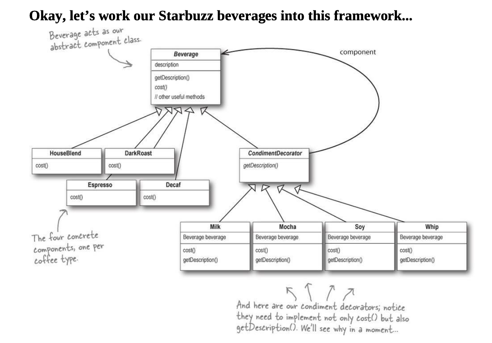

## UML Diagram for Basic Structure


## Code Example
```python
from abc import ABC, abstractmethod

# 1. The Component
# This is the base class that all components and decorators must follow.
class Component(ABC):
    @abstractmethod
    def methodA(self):
        pass

    @abstractmethod
    def methodB(self):
        pass

# 2. The ConcreteComponent
# This is the object we are going to dynamically add new behavior to.
class ConcreteComponent(Component):
    def methodA(self):
        return "ConcreteComponent: methodA"

    def methodB(self):
        return "ConcreteComponent: methodB"

# 3. The Decorator
# It implements the same interface as the Component it is going to decorate.
# It HAS-A (wraps) a component via an instance variable.
class Decorator(Component):
    def __init__(self, component: Component):
        self._wrappedObj = component  # The reference to the component

    @abstractmethod
    def methodA(self):
        pass

    @abstractmethod
    def methodB(self):
        pass

# 4. ConcreteDecoratorA
# Adds new behavior (newBehavior) to the component.
class ConcreteDecoratorA(Decorator):
    def methodA(self):
        # New behavior is typically added by doing computation before or after
        # an existing method in the component.
        return f"DecoratorA({self._wrappedObj.methodA()})"

    def methodB(self):
        return self._wrappedObj.methodB()

    def newBehavior(self):
        return "ConcreteDecoratorA: specifically adding newBehavior()"

# 5. ConcreteDecoratorB
# Extends the state of the component (newState).
class ConcreteDecoratorB(Decorator):
    def __init__(self, component: Component, state: str):
        super().__init__(component)
        self.newState = state  # Decorators can extend the state

    def methodA(self):
        return self._wrappedObj.methodA()

    def methodB(self):
        return f"DecoratorB with state '{self.newState}' wrapping -> {self._wrappedObj.methodB()}"

# --- Execution ---
if __name__ == "__main__":
    # Create the base component
    simple_component = ConcreteComponent()
    print(f"Basic: {simple_component.methodA()}")

    # Wrap it with Decorator A
    decorated_a = ConcreteDecoratorA(simple_component)
    print(f"Wrapped A: {decorated_a.methodA()}")
    print(decorated_a.newBehavior())

    # Wrap the already decorated component with Decorator B (Nesting)
    fully_decorated = ConcreteDecoratorB(decorated_a, "Active")
    print(f"Wrapped A+B: {fully_decorated.methodB()}")

```
## UML Diagram for Example



## Important Point:
Tea can also be a beverage and you can selectively have some or no condiments for it. If we had added condiments in Beverage, we might have broken sol`I`d principle.

I — Interface Segregation Principle (ISP)
Clients shouldn’t be forced to depend on methods they don’t use.