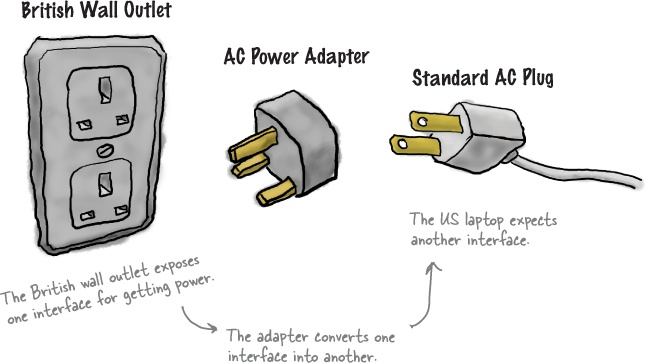
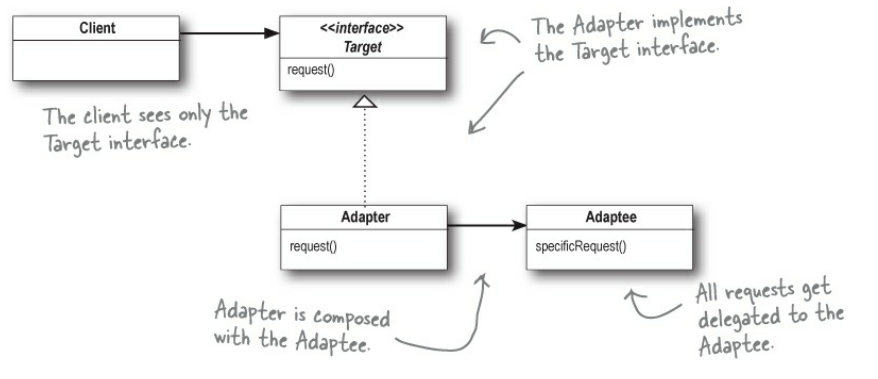

## Basic Idea for Adapter Pattern


## UML Class Diagram


## Code
```python
from abc import ABC, abstractmethod

# The Target: The interface the client sees and uses
class Target(ABC):
    @abstractmethod
    def request(self):
        pass

# The Adaptee: The class that needs adapting (has a different method name)
class Adaptee:
    def specific_request(self):
        return "Specific request from Adaptee"

# The Adapter: Implements Target and is composed with the Adaptee
class Adapter(Target):
    def __init__(self, adaptee: Adaptee):
        self._adaptee = adaptee
    
    def request(self):
        # All requests are delegated to the Adaptee
        return self._adaptee.specific_request()

# Client: Only sees the Target interface
if __name__ == "__main__":
    adaptee_instance = Adaptee()
    adapter = Adapter(adaptee_instance)
    
    print(f"Client call: {adapter.request()}")
```