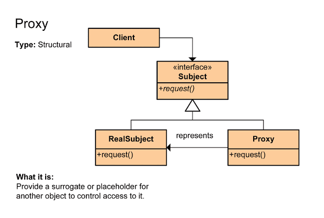

## 1. The Proxy Pattern

The Proxy pattern provides a **surrogate or placeholder** for another object to control access to it. Instead of the client interacting with the real object directly, it interacts with the Proxy, which then decides if, when, and how to pass the request to the "Real Subject."

### Common Types of Proxies:

* **Virtual Proxy:** Used for **Lazy Initialization**. It delays the creation of a heavy/expensive object until it is actually needed.
* **Protection Proxy:** Handles **Access Control**. It checks if a client has the necessary permissions before forwarding a call.
* **Remote Proxy:** Provides a local representation for an object that exists in a different address space (e.g., a server).
* **Caching Proxy:** Stores the results of expensive operations so they can be reused without calling the real object again.

---

## 2. Key Differences: Proxy vs. Decorator

The **Proxy** and **Decorator** patterns are both structural design patterns that use a "wrapper" approach to provide a level of indirection. While they look similar in code, their **intent** and how they manage the object they wrap are quite different.

The main difference lies in **what** the wrapper is trying to achieve.

| Feature | Proxy Pattern | Decorator Pattern |
| --- | --- | --- |
| **Primary Intent** | **Control Access:** Manage the lifecycle or restrict access to an object. | **Add Behavior:** Dynamically add new responsibilities to an object at runtime. |
| **Object Creation** | Usually **creates and manages** the real object internally. | Usually **receives** the object it wraps via its constructor (Aggregation). |
| **Relationship** | The Proxy often knows the specific type of its "Real Subject." | The Decorator only knows the Interface of the object it's wrapping. |
| **Stacking** | Not typically designed to be stacked (usually 1 Proxy per object). | Designed for **recursive stacking** (e.g., `new A(new B(new C(obj)))`). |
| **Visibility** | Often acts as a "black box"; the client may not even know a proxy is being used. | The client often actively "decorates" the object to build a specific feature set. |

---

## 3. Real-World Analogy

### The Decorator: A Coffee Shop

Think of a plain cup of coffee. You want to add milk (**MilkDecorator**), then sugar (**SugarDecorator**), then maybe whipped cream (**CreamDecorator**). Each "wrapper" adds a new feature (flavor/cost) to the original coffee. You can stack as many as you want.

### The Proxy: An ATM Card

Your ATM card is a **Proxy** for your bank account. You don't carry your actual bank vault around.

* **Access Control:** The card (Proxy) checks your PIN before letting you access the money.
* **Remote Access:** The card allows you to interact with your account even though the actual money is at the bank's headquarters.
* It isn't "adding flavor" to your money; it is **controlling how and when you get to it**.

---

## 4. Code Example (Mental Model)

In a **Decorator**, you pass the object in:

```java
// Decorator: Client decides to add logging
Service logger = new LoggingDecorator(new RealService());

```

In a **Proxy**, the proxy often hides the object:

```java
// Proxy: Client doesn't know RealService is being lazy-loaded
Service proxy = new LazyServiceProxy(); 
proxy.request(); // RealService is created only now, inside the proxy

```

## 5. Types of Proxy Patterns

To understand how Proxies work in the real world, it helps to see how they intercept calls for different purposes. Here are examples of the four most common types.

---

### 1. Virtual Proxy (Lazy Initialization)

A Virtual Proxy is used when the "Real Subject" is **resource-intensive** to create (e.g., it consumes a lot of memory or takes time to load). The proxy stands in as a lightweight placeholder and only creates the real object when a method is actually called.

* **Scenario:** High-resolution image viewer.
* **Logic:** The proxy displays a "Loading..." message or a tiny thumbnail until the user scrolls to that specific image.

```java
public class HighResImageProxy implements Image {
    private String fileName;
    private RealHighResImage realImage; // The expensive object

    public HighResImageProxy(String fileName) {
        this.fileName = fileName;
    }

    public void display() {
        if (realImage == null) {
            realImage = new RealHighResImage(fileName); // Load only when needed
        }
        realImage.display();
    }
}

```

---

### 2. Protection Proxy (Access Control)

A Protection Proxy acts as a gatekeeper. It checks the **credentials or permissions** of the client before allowing them to access the sensitive methods of the real object.

* **Scenario:** An office internet server.
* **Logic:** The proxy checks if a website is on the "Blocked" list before forwarding the request.

```python
class InternetProxy:
    def __init__(self):
        self.real_internet = RealInternet()
        self.restricted_sites = ["socialmedia.com", "gaming.com"]

    def connect_to(self, url):
        if url.lower() in self.restricted_sites:
            print("Access Denied: This site is blocked by your organization.")
        else:
            self.real_internet.connect_to(url)

```

---

### 3. Remote Proxy (Local Representative)

A Remote Proxy provides a local object that represents an object living in a **different address space** (on another server, in a different JVM, or in the cloud). The proxy handles all the messy networking logic (sockets, marshaling, etc.) so the client thinks it's calling a local method.

* **Scenario:** A Weather API client.
* **Logic:** When you call `weatherProxy.getTemperature()`, the proxy sends a network request to a server in another country and returns the result to you.

---

### 4. Caching Proxy (Performance Optimization)

A Caching Proxy stores the results of expensive operations. When multiple clients request the same data, the proxy returns the **cached version** instead of making the "Real Subject" perform the calculation or database query again.

* **Scenario:** A Database Query wrapper.
* **Logic:** If the same SQL query is run twice, the proxy returns the data from memory (RAM) the second time.

```javascript
class DatabaseProxy {
    constructor() {
        this.realDb = new RealDatabase();
        this.cache = {};
    }

    query(sql) {
        if (this.cache[sql]) {
            console.log("Returning result from cache...");
            return this.cache[sql];
        }
        const result = this.realDb.query(sql);
        this.cache[sql] = result;
        return result;
    }
}

```

---

### Summary Table

| Proxy Type | Purpose | Key Benefit |
| --- | --- | --- |
| **Virtual** | Delay object creation | Saves Memory/Startup time |
| **Protection** | Verify permissions | Security |
| **Remote** | Represent distant objects | Simplifies Networking |
| **Caching** | Store previous results | Speed/Efficiency |


## 6. Basic UML Diagram


Here is the Python implementation of the Proxy pattern as described in your UML diagram. In Python, we use the `abc` (Abstract Base Classes) module to define the **Subject** interface.

---

### 1. Define the Interface (Subject)

This acts as the blueprint for both the real object and its proxy.

```python
from abc import ABC, abstractmethod

class Subject(ABC):
    @abstractmethod
    def do_action(self):
        pass

```

### 2. Implement the Real Subject (RealSubject)

This class contains the actual business logic. In many cases, this object is "heavy" or requires specific access controls.

```python
class RealSubject(Subject):
    def do_action(self):
        print("RealSubject: Handling the request and executing core logic.")

```

### 3. Implement the Proxy

The Proxy maintains a reference to the `RealSubject` (the **delegate**) and controls access to it.

```python
class Proxy(Subject):
    def __init__(self):
        # We don't initialize RealSubject yet (Lazy Initialization)
        self._real_subject = None

    def do_action(self):
        # 1. Check if the real object exists, if not, create it
        if self._real_subject is None:
            print("Proxy: RealSubject is not initialized. Creating it now...")
            self._real_subject = RealSubject()

        # 2. Add extra behavior (e.g., logging or security checks)
        print("Proxy: Logging the time of request before delegating.")
        
        # 3. Delegation: Pass the work to the real object
        self._real_subject.do_action()
        
        print("Proxy: Request finished.")

```

### 4. The Client

The client code works with any object that follows the `Subject` interface.

```python
def client_code(subject: Subject):
    # The client doesn't know if 'subject' is a Proxy or a RealSubject
    subject.do_action()

if __name__ == "__main__":
    print("Client: Calling the service via a proxy:")
    proxy = Proxy()
    client_code(proxy)

```

---

### Key Takeaways for Python:

* **Composition over Inheritance:** The Proxy doesn't inherit logic from `RealSubject`; it **contains** an instance of it. This is the "delegate" relationship shown in your diagram.
* **Lazy Loading:** By setting `self._real_subject = None` in the constructor and only creating it inside `do_action`, you save memory if the action is never actually called.
* **Transparency:** Since both classes inherit from `Subject`, you can swap the real object for the proxy anywhere in your code without breaking the client.
